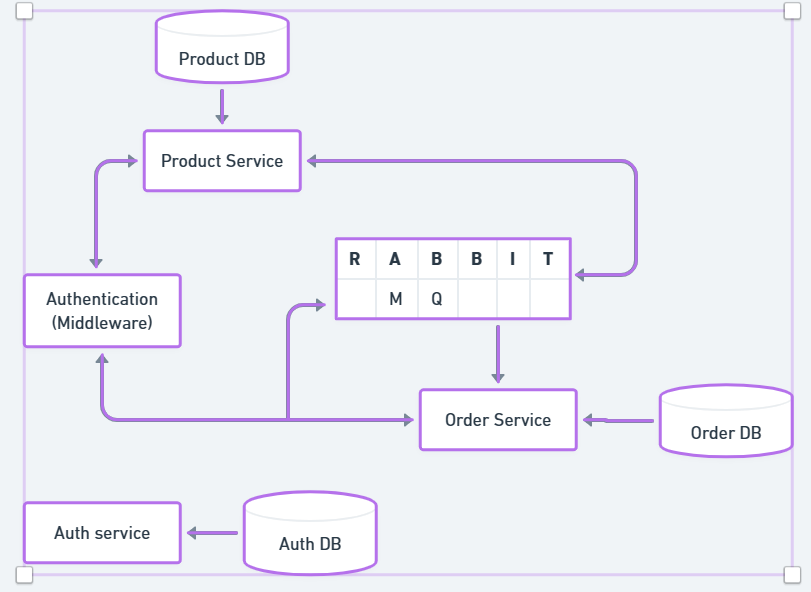

## E-Commerce Microservice Application

This repository contains a web e-commerce application which runs three microservices for an e-commerce platform: auth-service, product-service, and order-service, all these services run in their own containers.

## Design

### Setup Instructions

Make sure to have docker and postman installed on your machine.

### Run the following commands under e-commerce directory:
## Create Docker network
docker network create e-commerce

### Run MongoDB container
docker run --name mongodb --network e-commerce mongo

### Run RabbitMQ container
docker run --name rabbitmq --network e-commerce rabbitmq

### Run the following commands under auth folder build and run auth-service
docker build -t auth-service .
docker run --name auth-service --network e-commerce -p 7070:7070 auth-service &

### Run the following commands under order folder to build and run order-service
docker build -t order-service .
docker run --name order-service --network e-commerce -p 9090:9090 order-service &

### Run the following commands under product folder to build and run product-service
docker build -t product-service .
docker run --name product-service --network e-commerce -p 8080:8080 product-service &

## Microservices

### Auth-Service
Description: Handles user authentication and authorization.
Folder: auth-service
Endpoints:
POST /auth/register: Register a new user.
POST /auth/login: User login.

### Product-Service
Description: Manages products and inventory.
Folder: product-service
Endpoints:
GET /product/products: Get all products.
POST /product/create: Create a new product.
POST /product/update: Update product price.
POST /product/buy: Order products.

### Order-Service
Description: Handles order management and processing.
Folder: order-service
Endpoints:
GET /order/orders: Get orders for a user.

## Assumptions
Products orders can only be viewed and cannot be deleted/updated.
Product can only be updated for price.
Products do not have quantities associated.
Delivery location and status are not maintained.

## Application briefing 
## Messaging with Queue

The microservices utilize RabbitMQ as a message broker for asynchronous communication between them. Each microservice can publish messages to specific queues, and other microservices can consume messages from these queues.

## Usage in Product-Service
When a user places an order for products, the Product-Service publishes the order details to the ORDER queue.
The Order-Service then consumes messages from this queue, processes the order, and updates the database accordingly.

## Database Structure
MongoDB is used as the database for storing product and user information. The database structure is designed as follows:

## Product Collection

Stores information about products available for purchase. Each product document contains fields such as name, description, price, and version.

## User Collection

Stores information about registered users. Each user document contains fields such as email, password (hashed), and name.

## Order Collection

Stores information about user orders. Each order document contains fields such as products (array of ordered products), total_price, userEmail, and createdAt.

## Authorization Middleware
An authorization middleware is implemented to ensure that authenticated users have the necessary permissions to access certain routes. The middleware extracts the JWT token from the request headers, verifies its validity, and attaches the user information to the request object for further processing.

## Usage
The middleware is applied to protected routes such as creating, updating, or deleting products. If a request lacks a valid token or the user does not have the required permissions, the middleware returns a 401 Unauthorized error.

## Concurrency Avoidance
To prevent concurrency issues such as race conditions or inconsistent data updates, optimistic locking is employed in the Product-Service for updating product details. Each product document contains a version field, which is incremented on every update operation.

## Optimistic Locking
When updating a product's price, the Product-Service compares the provided version with the current version in the database. If they match, the update proceeds, and the version is incremented. If not, a 409 Conflict error is returned, indicating a concurrent modification detected.

## Rate limitting
Order and Product services which have exposed routes have a rate limitting in place to avoid resource hogging.

## Summary
RabbitMQ facilitates asynchronous messaging between microservices.
MongoDB stores data in collections with specific schemas for products, users, and orders.
An authorization middleware verifies user authentication and permissions.
Optimistic locking ensures data consistency by preventing concurrent modifications to product information.
These mechanisms collectively enable secure and reliable communication and data management within the e-commerce microservices architecture.

## Unit test cases
Unit test cases have been added for microservices covering the cases. (Need to be run manually: npx jest in respective folders)

## Testing APIs
Ecommerce API test.postman_collection.json can be imported in postman to test all the possible APIs.
PS: Please make sure to update the header with "authorization": "Bearer xxxxxxx" (replace xxxxxxx with token recieved from login.)
